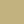
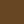

# infog-maxcontrast

Colors of Maximum Contrast Reference card

| # |Color Name      |ISCC-NBS Number|   Hex  | R | G | B |Sample|
|:-:|----------------|---------------|--------|--:|--:|--:|-----:|
| 1 | white          |263            | F2F3F4 |242|243|244||
| 2 | black          |267            | 222222 | 34| 34| 34||
| 3 | yellow         |82             | F3C300 |243|195|  0||
| 4 | purple         |218            | 875692 |135| 86|146||
| 5 | orange         |48             | F38400 |243|132|  0||
| 6 | light blue     |180            | A1CAF1 |161|202|241||
| 7 | red            |11             | BE0032 |190|  0| 50||
| 8 | buff           |90             | C2B280 |194|178|128||
| 9 | grey           |265            | 848482 |132|132|130||
|10 | green          |139            | 008856 |  0|136| 86||
|11 | purplish pink  |247            | E68FAC |230|143|172||
|12 | blue           |178            | 0067A5 |  0|103|165||
|13 | yellowish pink |26             | F99379 |249|147|121||
|14 | violet         |207            | 604E97 | 96| 78|151||
|15 | orange yellow  |66             | F6A600 |246|166|  0||
|16 | purplish red   |255            | B3446C |179| 68|108||
|17 | greenish yellow|97             | DCD300 |220|211|  0||
|18 | reddish brown  |40             | 882D17 |136| 45| 23||
|19 | yellow green   |115            | 8DB600 |141|182|  0||
|20 | yellowish brown|75             | 654522 |101| 69| 34||
|21 | reddish orange |34             | E25822 |226| 88| 34||
|22 | olive green    |126            | 2B3D26 | 43| 61| 38||

### References

* [LifeHacker](http://hackerspace.lifehacker.com/some-os-x-calendar-tips-1658107833/1665644975/+whitsongordon)

daniele.olmisani@gmail.com
